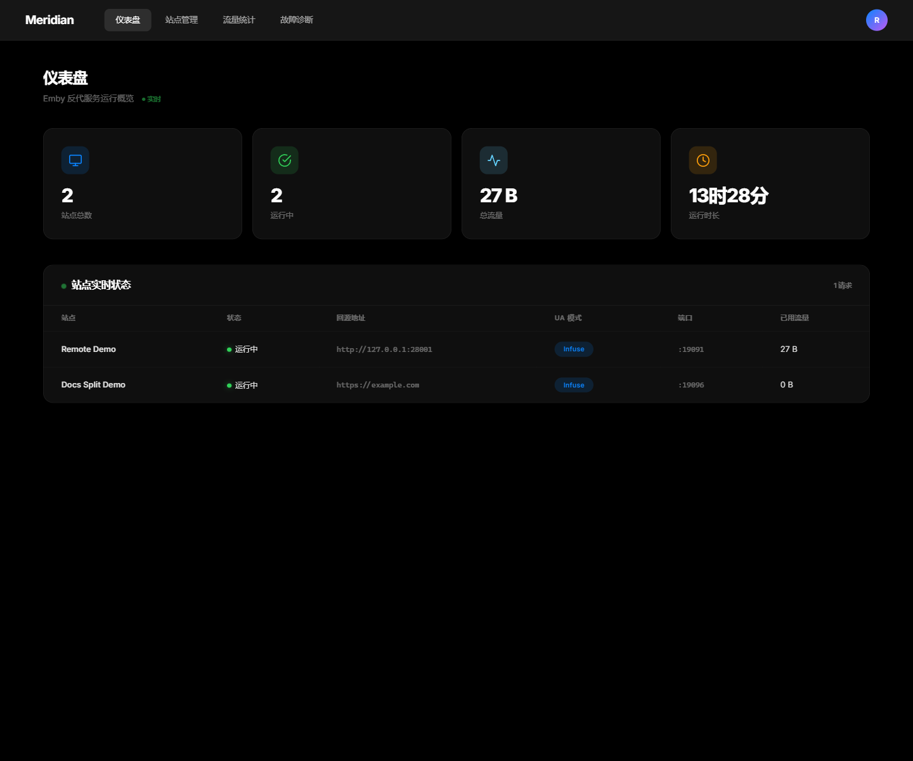
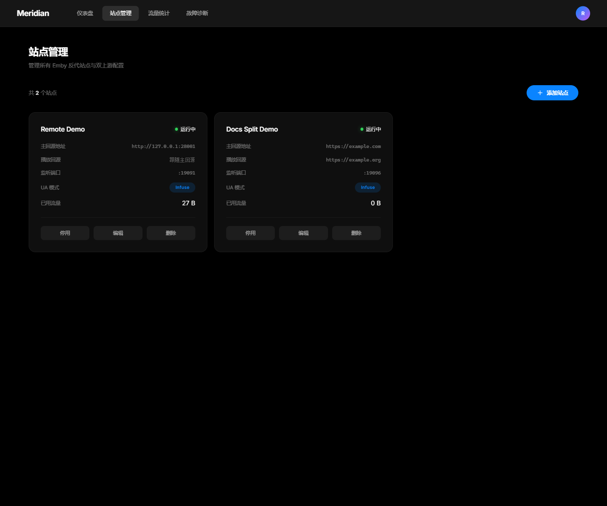
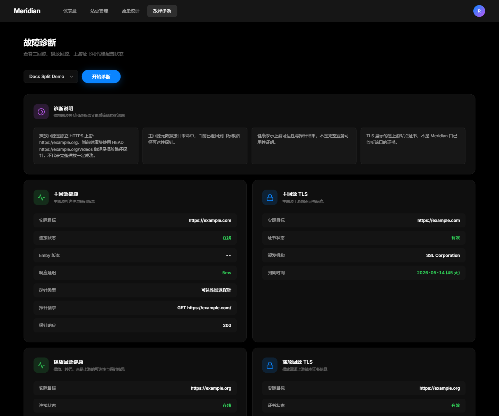

<div align="center">

# Meridian-Merged

基于 [Meridian](https://github.com/snnabb/Meridian) 的增强版 Emby 反向代理管理面板

融合了分离版推流 + 配置导出/导入功能

[](https://go.dev)
[](https://pkg.go.dev/modernc.org/sqlite)
[](LICENSE)

</div>

---

## 这是什么

本项目在 **Meridian** 原版基础上，融合了 Cloudflare Worker 反代面板的核心功能，保持 Meridian 的 Go 单二进制架构不变，新增了：

- ✅ **分离版推流**（`playback_target_url` + `stream_hosts` 多节点配置）
- ✅ **配置导出**（一键下载全站点 JSON 备份）
- ✅ **配置导入**（从备份文件批量还原站点）

---

## 界面预览

| 仪表盘 | 站点管理 | 故障诊断 |
|:---:|:---:|:---:|
|  |  |  |

---

## 新增功能说明

### 分离版推流

每个站点支持独立的播放回源配置，实现 **API 流量** 与 **媒体推流** 的完全分离：

| 字段 | 用途 | 示例 |
|------|------|------|
| **主回源** `target_url` | 网页、API、元数据、登录 | `https://emby.example.com` |
| **播放回源** `playback_target_url` | 视频、音频、直播、转码 | `https://cdn.example.com` |
| **额外推流节点** `stream_hosts` | 多 CDN / 多节点备援 | `https://node2.example.com` |

播放路由判定路径：

```
/Videos/  /emby/Videos/  /Audio/  /emby/Audio/
/LiveTV/  /emby/LiveTV/  /Items/.../Download
```

播放模式：

- **直连分流**：播放请求直接命中首个播放回源（适合完整 Emby 实例）
- **重定向跟随**：跟随上游重定向到任意播放节点（适合多节点 CDN 分发）

---

### 配置导出 / 导入

在「站点管理」页工具栏新增两个按钮：

#### 导出配置

点击「导出配置」，自动下载包含全部站点信息的 JSON 备份文件：

```json
{
  "version": "meridian-v1",
  "sites": [
    {
      "name": "Emby-US-01",
      "listen_port": 8001,
      "target_url": "https://emby.example.com",
      "playback_target_url": "https://cdn.example.com",
      "playback_mode": "direct",
      "stream_hosts": ["https://node2.example.com"],
      "ua_mode": "infuse",
      "traffic_quota": 0,
      "speed_limit": 0
    }
  ]
}
```

文件名格式：`meridian_backup_YYYY-MM-DD.json`

#### 导入配置

点击「导入配置」，选择之前导出的 JSON 文件。支持两种格式：

- 标准格式：含 `version` + `sites` 字段的对象
- 简化格式：直接是站点数组

导入前会弹出确认窗口，列出所有即将创建的站点。导入不覆盖现有站点，每条记录均会新建。

---

## 后端 API 变更

本版本新增两个接口，其余 API 与原版完全兼容：

| 方法 | 路径 | 说明 |
|------|------|------|
| `GET` | `/api/sites/export` | 导出全部站点为 JSON（触发下载） |
| `POST` | `/api/sites/import` | 批量导入站点，返回 `{created, skipped}` |

---

## 快速部署

### 从源码构建

```bash
git clone https://github.com/tsumon/Meridian-merged.git
cd Meridian-merged
go build -o meridian .
JWT_SECRET=$(openssl rand -hex 32) ./meridian
```

访问 `http://你的IP:9090`，首次打开引导设置管理员密码。

### Docker

```bash
docker run -d --name meridian \
  -p 9090:9090 -p 8001-8010:8001-8010 \
  -v meridian-data:/app/data \
  -e JWT_SECRET=$(openssl rand -hex 32) \
  ghcr.io/snnabb/meridian:latest
```

### Linux 一键安装（原版脚本）

```bash
bash <(curl -sL https://raw.githubusercontent.com/snnabb/Meridian/master/install.sh)
```

---

## 配置

### 命令行参数

```bash
./meridian                          # 默认 :9090
./meridian --port 8080              # 自定义端口
./meridian --db /data/meridian.db   # 自定义数据库路径
```

### 环境变量

| 变量 | 默认值 | 说明 |
|------|--------|------|
| `PORT` | `9090` | 管理面板监听端口 |
| `DB_PATH` | `meridian.db` | SQLite 数据库路径 |
| `JWT_SECRET` | 随机生成 | JWT 签名密钥，**生产环境必须显式设置** |

### Docker Compose

```yaml
services:
  meridian:
    image: ghcr.io/snnabb/meridian:latest
    restart: unless-stopped
    ports:
      - "9090:9090"
      - "8001-8010:8001-8010"
    volumes:
      - meridian-data:/app/data
    environment:
      - JWT_SECRET=your-secret-here

volumes:
  meridian-data:
```

---

## 原版核心特性

继承自 [Meridian](https://github.com/snnabb/Meridian) 的全部功能：

| 功能 | 说明 |
|------|------|
| **多站点反代** | 每个站点独立监听端口，独立配置上游 |
| **UA 伪装** | Infuse / Web / 客户端 三种预设，HTTP + WebSocket 统一改写 |
| **流量管控** | 按站点统计流量、设置限速、设置配额 |
| **WebSocket 代理** | 完整支持 Emby WebSocket 通信 |
| **SSE 实时推送** | 仪表盘数据实时更新 |
| **故障诊断** | 回源健康检测、TLS 证书检查、请求头预览 |
| **JWT 认证** | Bearer Token 认证，密码 bcrypt 存储 |
| **单二进制部署** | 前端嵌入二进制，SQLite 持久化，无外部依赖 |

---

## 技术架构

```
┌─────────────────────────────────────────────────┐
│                 Meridian-Merged                   │
│                                                  │
│  ┌──────────┐   ┌────────────────────────────┐   │
│  │ 管理面板  │   │    反代引擎 (per-site)      │   │
│  │ :9090    │   │  :8001  :8002  :800N       │   │
│  │          │   │                            │   │
│  │ REST API │   │  HTTP  ──► target_url      │   │
│  │ SSE 推送 │   │  WS    ──► target_url      │   │
│  │ 静态文件  │   │  播放  ──► playback_target  │   │
│  │ 导出导入  │   │  备援  ──► stream_hosts[]  │   │
│  └──────────┘   └────────────────────────────┘   │
│        │                    │                    │
│  ┌───────────────────────────────────────────┐   │
│  │              SQLite (嵌入式)               │   │
│  └───────────────────────────────────────────┘   │
└─────────────────────────────────────────────────┘
```

| 组件 | 技术选型 |
|------|---------|
| 后端 | 单文件 Go（`main.go`），标准库 `net/http` |
| 前端 | 原生 HTML/CSS/JS SPA，hash 路由，`embed.FS` 嵌入 |
| 数据库 | `modernc.org/sqlite`（纯 Go，无 CGO） |
| 认证 | 自实现 HMAC-SHA256 JWT |

### 项目结构

```
Meridian-merged/
├── main.go                        # 后端逻辑（新增 export/import handler）
├── main_test.go
├── web/
│   ├── embed.go
│   └── static/
│       ├── index.html
│       ├── css/
│       └── js/
│           ├── api.js             # 新增 exportSites / importSites 方法
│           ├── app.js
│           ├── router.js
│           ├── toast.js
│           └── pages/
│               ├── sites.js      # 新增导出/导入按钮与逻辑
│               ├── dashboard.js
│               ├── diag.js
│               └── traffic.js
├── Dockerfile
├── go.mod / go.sum
└── .github/workflows/
```

---

## 改动文件清单

相比原版 Meridian，本项目共改动 3 个文件：

### `main.go`（新增约 100 行）

- `ExportSiteRecord` 结构体：定义导出/导入的 JSON 字段
- `handleSitesExport()`：`GET /api/sites/export`，序列化全站点并以附件形式下载
- `handleSitesImport()`：`POST /api/sites/import`，批量写库并自动启动，返回统计
- 路由注册优先于 `/api/sites/` 通配符，防止被吞

### `web/static/js/pages/sites.js`（新增约 90 行）

- 工具栏新增「导出配置」「导入配置」按钮及隐藏文件选择器
- `exportSitesConfig()`：调用导出接口，Blob 转下载链接
- `importSitesConfig()`：读取 JSON 文件，兼容数组/对象两种格式，弹窗确认后批量导入

### `web/static/js/api.js`（新增 2 行）

- `API.exportSites()`
- `API.importSites(sites)`

---

## 备份与恢复

### 方式一：JSON 导出（推荐）

在面板「站点管理」页点击「导出配置」，保存 JSON 文件。需要恢复时点击「导入配置」选择文件即可。

### 方式二：SQLite 直接备份

最小备份集：

```
meridian.db
meridian.db-wal
meridian.db-shm
```

恢复时停止服务 → 还原数据库文件 → 用原 `JWT_SECRET` 重启。

---

## 运维要点

- **JWT 密钥**：未设置 `JWT_SECRET` 时每次启动随机生成，重启后会话全部失效
- **流量持久化**：每 60 秒刷入 SQLite，异常退出可能丢失最近一分钟计量
- **导入幂等性**：导入不覆盖现有站点，重复导入会新建同名站点
- **优雅关闭**：收到 `SIGINT`/`SIGTERM` 后先 flush 流量再退出

---

## 上游项目

本项目基于以下开源项目：

- [Meridian](https://github.com/snnabb/Meridian) — MIT License，原版 Emby 反代管理面板

---

## License

MIT
